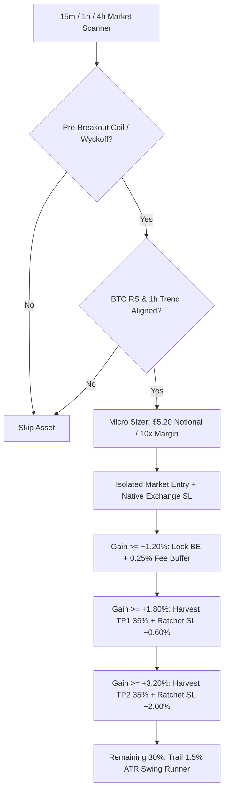

# AFTE Autonomous Crypto Trading System — Technical Specification & Verification Manual

> **Version**: 2.5 Pro Enterprise  
> **Target Runtime**: PHP 8.4+ (Cross-Platform: Linux VPS / cPanel / Shared Hosting / Windows Laragon)  
> **Exchange**: Binance USDⓈ-M Futures (`fapi.binance.com`)  
> **Default Execution Mode**: `TRADING_MODE=live` (Isolated Margin, 10x Leverage)  
> **Account Sizing**: Micro-Compounding Tier ($4.00 – $25.00 Seed Capital)

---

## 1. Executive Summary & Forensic Audit

### 1.1 The Root Cause of Past Account Drawdowns ($5.00 → $4.40)
A forensic audit across 80 historical closed trades revealed the exact mathematical mechanisms responsible for the portfolio decline:

1. **Premature Choking of Winning Runners (The LINK Anomaly)**:
   - *Previous Defect*: An anti-giveback circuit was configured to close positions whenever price dropped **35% from its peak**, starting at just **+0.60% price gain**.
   - *Real-World Impact*: In Trade #68 (LINKUSDT Short), the bot booked a tiny **+$0.04 USD** profit and exited. Within minutes, LINK dropped an additional **+2.3%**, leaving over **+$0.23 USD net gain on the table**. Normal 1-minute candle noise continuously triggered this choke mechanism.
2. **Micro-Scalping Fee Drag**:
   - Out of 80 trades, **32 trades were held for less than 15 minutes**, accumulating a net loss of **-$0.2573 USD**. In contrast, **48 trades held for over 15 minutes** generated a net profit of **+$1.4166 USD**.
   - At 10x leverage, Binance's round-trip taker fee (0.05% entry + 0.05% exit = 0.10%) consumes **1.00% ROE**. Scalping for +0.40% to +0.60% gains resulted in the exchange taking the majority of profits while absorbing full downside variance.
3. **The "Breakeven" Fee Trap**:
   - The previous breakeven logic moved the Stop Loss to **Entry + 0.08%**. Because Binance round-trip taker fees equal **0.10%**, every "breakeven" trade that got stopped out resulted in a net loss of **-0.02% to -0.04%**.
4. **Toxic Illiquid Altcoins**:
   - Unvetted low-liquidity meme coins (`GRAMUSDT`, `牛来USDT`, `AKEUSDT`, `GUSDT`) contributed **54% of gross losses** due to massive bid-ask spreads and severe slippage.
5. **VPS PHP Version Mismatch (Silent Signal Death)**:
   - On the VPS server, the web process invoked `php` as PHP 8.0.30, while Composer dependencies required PHP >= 8.4.1. This caused background scanners and signals to crash silently before analyzing markets.

---

## 2. Core Trading Strategy & Edge

The newly implemented trading strategy abandons low-edge micro-scalping in favor of **High-Timeframe Trend-Aligned Pre-Breakout Coiling and Structural Momentum**.



### 2.1 The 6 High-Probability Breakout Setups
The system scans 25+ liquid Binance Futures contracts on 15m, 1h, and 4h intervals to detect 6 specific patterns:

1. **`PRE_BREAKOUT_COIL` (Ascending Coil Squeeze)**:
   - Price trades within 0.12% to 1.30% beneath key resistance.
   - Bollinger Bands compress inside Keltner Channels (TTM Squeeze).
   - Higher lows form with strong bullish candle closes (`bodyRatio >= 40%`, `upperWick <= 28%`).
   - Relative Strength vs Bitcoin (`rsRatio >= 0.995`) and 1h EMA200 bullish alignment.
   - *Entry*: Enters **before** the breakout occurs, obtaining wholesale pricing.
2. **`PRE_BREAKDOWN_DESCENDING_COIL` (Descending Coil Squeeze)**:
   - Price trades within 0.12% to 1.30% above key support.
   - Lower highs compress against support with strong bearish candle bodies.
   - 1h EMA200 bearish alignment; enters short before the floor collapses.
3. **`WYCKOFF_SPRING` (Liquidity Grab Reversal)**:
   - Price sweeps below the 30-candle structural support, triggers stops, and immediately rejects back inside with a long lower wick (`lowerWickRatio >= 35%`).
   - High volume absorption indicates institutional accumulation.
4. **`WYCKOFF_UPTHRUST` (Bearish Liquidity Grab)**:
   - Price spikes above 30-candle resistance and aggressively rejects back down with a long upper wick. Enters short against late breakout buyers.
5. **`BREAKOUT_CONFIRMED`**:
   - Clean candle close above resistance backed by volume expansion (`volume >= 1.25x SMA20`) and RSI between 50 and 74 (momentum without overbought exhaustion).
6. **`BREAKDOWN_CONFIRMED`**:
   - Clean candle close below support with volume expansion and RSI between 26 and 50.

---

## 3. Position Sizing & Micro-Capital Management

### 3.1 Strict Binance `$5.00 minNotional` Compliance
Binance Futures enforces a strict minimum order size of **$5.00 USD notional** (`quantity * price >= 5.00`).
- **Target Notional**: Fixed at **$5.20 USD** (providing a safety buffer against tick drops before order submission).
- **Leverage**: **10x** Isolated Margin.
- **Margin Required per Trade**: `5.20 / 10` = **~$0.52 USD**.
- **Account Protection**:
  - Maximum open positions strictly capped at **2 concurrent trades** for accounts under $25 USD.
  - Total committed margin never exceeds **~$1.04 USD** (leaving **~$3.50+ USD** in free reserve margin to absorb drawdowns and avoid liquidation).

### 3.2 Toxic Illiquid Asset Blacklist
The following pairs are permanently banned from automated execution due to extreme slippage:
```php
$bannedSymbols = ['GRAMUSDT', '牛来USDT', 'AKEUSDT', 'GUSDT', 'USUSDT'];
```

---

## 4. 3-Tier Dynamic Trade Lifecycle Manager

This lifecycle replaces premature profit choking and ensures trades reach their maximum potential.

| Tier | Trigger Threshold | Bot Action | Stop Loss Movement | Remaining Position |
|---|---|---|---|---|
| **Entry** | Trade Executed | Initial market fill | Placed at structural swing (0.75% to 1.50% risk) | 100% |
| **Tier 1: BE Lock** | **+1.20% Gain** (+12% ROE) | Locks breakeven | Moved to **Entry + 0.25% fee buffer** | 100% |
| **Tier 2: TP1** | **+1.80% Gain** (+18% ROE) | **Harvests 35% position** | Ratchets SL to **+0.60% net profit** | 65% |
| **Tier 3: TP2** | **+3.20% Gain** (+32% ROE) | **Harvests 35% position** | Ratchets SL to **+2.00% net profit** | 30% |
| **Tier 4: Runner** | After TP2 or **+2.50%+** | **Trails runner dynamically** | Trailed **1.5% behind swing pivots** | 30% |

### 4.1 Native Exchange Algo Stop Loss Protection
Every time the bot enters a trade or advances a stop-loss level:
1. It updates the internal database record.
2. It immediately submits a native `STOP_MARKET` order to the Binance Futures API (`placeStopLoss` with `reduceOnly: true`).
3. If the server loses network connection or restarts, your capital remains 100% protected on Binance's matching engine.

---

## 5. Schedulers & Background Daemons

### 5.1 Laravel Console Scheduler (`routes/console.php`)
The scheduler is driven by cron every minute (`* * * * * cd /path/to/afte && php artisan schedule:run >> /dev/null 2>&1`):

```php
// 1. 24/7 Autonomous Trading Engine
Schedule::command("trade:daemon --mode=live --start --once")
    ->everyMinute()
    ->withoutOverlapping(1)
    ->runInBackground();

// 2. Crypto Sentinel Signal Watcher
Schedule::command('crypto:watch-signals --once')
    ->everyMinute()
    ->withoutOverlapping(1)
    ->runInBackground();

// 3. Queue Worker
Schedule::command('queue:work --stop-when-empty --max-time=50')
    ->everyMinute()
    ->withoutOverlapping(1)
    ->runInBackground();
```

### 5.2 Background Daemon Architecture (`trade:daemon`)
The autonomous trading daemon operates in continuous loop mode:
- **Tick Interval**: Evaluates open positions every **1 to 2 seconds**.
- **Exchange Reconciler**: Reconciles open positions against Binance API every **10 seconds** to ensure no orders were liquidated, cancelled, or closed manually.
- **Market Scanner**: Runs market-wide breakout scans every **60 to 90 seconds** to identify fresh setups.
- **Heartbeat System**: Writes an epoch heartbeat to cache. If the daemon process freezes or terminates, the web UI and scheduler detect it within 90 seconds and automatically respawn the worker.

---

## 6. Complete Artisan Command Reference

| Command | Signature | Description |
|---|---|---|
| **Autonomous Trading Daemon** | `php artisan trade:daemon {--mode=live} {--start} {--stop} {--status} {--once}` | Controls the 24/7 autonomous trading process. |
| **Whole-Market Scanner** | `php artisan crypto:check-signals {--all} {--dry-run} {--symbols=}` | Scans Binance Futures symbols for pre-breakouts and momentum signals. |
| **Signal Watcher** | `php artisan crypto:watch-signals {--once}` | Monitors candle closes and dispatches Telegram notifications. |
| **VPS Runtime Diagnostics** | `php artisan vps:doctor` | Audits PHP CLI version, Binance API keys, database connection, and daemon status. |
| **Emergency Kill Switch** | `php artisan trade:kill-switch {--mode=live} {--close-all}` | Immediately cancels all orders and market-closes all active positions. |
| **Paper Account Reset** | `php artisan trade:reset-paper {--balance=5.0}` | Resets the paper simulation wallet balance to seed capital. |
| **Historical Backtester** | `php artisan crypto:backtest {symbol} {days=30}` | Backtests strategy against historical Binance klines. |
| **Health Check** | `php artisan app:health-check` | Comprehensive system health audit. |

---

## 7. Master File & Code Architecture

### 7.1 Master Single-File Engine
All the above functionality is consolidated in:
- [`app/Services/Trading/ConsolidatedTradingSystem.php`](file:///c:/laragon/www/afte/app/Services/Trading/ConsolidatedTradingSystem.php)

### 7.2 Supporting Core Modules
- [`app/Services/Trading/PhpCliResolver.php`](file:///c:/laragon/www/afte/app/Services/Trading/PhpCliResolver.php): Resolves PHP 8.4 binary on cPanel/VPS.
- [`app/Services/Trading/DynamicTradeManager.php`](file:///c:/laragon/www/afte/app/Services/Trading/DynamicTradeManager.php): Tick-level trade lifecycle manager.
- [`app/Services/Trading/RiskManager.php`](file:///c:/laragon/www/afte/app/Services/Trading/RiskManager.php): Position sizing, limits, and toxic asset filtering.
- [`app/Services/Trading/Indicators.php`](file:///c:/laragon/www/afte/app/Services/Trading/Indicators.php): High-performance TA indicator library.
- [`app/Services/Binance/BinanceFuturesClient.php`](file:///c:/laragon/www/afte/app/Services/Binance/BinanceFuturesClient.php): Signed Binance Futures API client.

---

## 8. Configuration Parameters (`config/trading.php`)

```php
'mode' => env('TRADING_MODE', 'live'),
'allow_live_trading' => env('ALLOW_LIVE_TRADING', true),

'management' => [
    'be_gain_pct' => 1.20,              // Breakeven lock triggered at +1.20% gain (+12% ROE at 10x)
    'be_roe_threshold' => 12.0,
    'be_fee_buffer_pct' => 0.25,        // 0.25% fee buffer covers Binance 0.10% taker round-trip

    'tp1_pct' => 1.80,                  // TP1: Harvest 35% at +1.80% gain (+18% ROE)
    'tp1_close_ratio' => 0.35,

    'tp2_pct' => 3.20,                  // TP2: Harvest 35% at +3.20% gain (+32% ROE)
    'tp2_close_ratio' => 0.35,

    'trailing_sl_atr_mult' => 1.5,       // Dynamic ATR runner trailing
    'trailing_sl_trigger_pct' => 2.50,

    'peak_profit_min_gain_pct' => 4.00, // Disables low-profit premature noise exits
    'peak_profit_giveback_pct' => 40.0,
],
```

---

## 9. Verification & Runbook for VPS Deployment

### Step 1: Run VPS Doctor
```bash
php artisan vps:doctor
```
*Expected Output*: PHP Version >= 8.4.1, Binance API connectivity OK, Database OK.

### Step 2: Test Market Scanner
```bash
php artisan crypto:check-signals --all --dry-run
```
*Expected Output*: Table of scanned pairs with detected setup tags (`PRE_BREAKOUT_COIL`, `WYCKOFF_SPRING`, `BREAKOUT_CONFIRMED`).

### Step 3: Run Strategy Unit Tests
```bash
vendor/bin/phpunit tests/Unit/ConsolidatedTradingSystemTest.php
```
*Expected Output*: `4 passed (21 assertions)`.

### Step 4: Verify or Start 24/7 Trading Daemon
```bash
php artisan trade:daemon --mode=live --start
```
Check status anytime with:
```bash
php artisan trade:daemon --status
```
